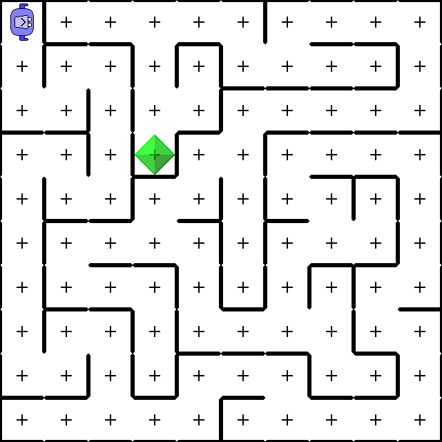

## Background

Karel The Robot is a simple teaching environment for imperative programming basics.
The original idea was developed in the 1970s by Richard Pattis at Stanford University:

> In the 1970s, a Stanford graduate student named Rich Pattis decided that it would be easier to teach the fundamentals of programming if students could somehow learn the basic ideas in a simple environment free from the complexities that characterize most programming languages.


> In sophisticated languages like Java, there are so many details that learning these details often becomes the focus of the course. When that happens, the much more critical issues of **problem solving** tend to get lost in the shuffle. By starting with Karel, you can concentrate on solving problems from the very beginning. And because Karel encourages imagination and creativity, you can have quite a lot of fun along the way.

This project started in 2012 due to dissatisfaction with the available Karel environments.
Since then, thousands of German university students have been introduced to the basics of imperative programming via this project.

### Problem solving

Problem solving means translating human-understandable problem descriptions into machine-executable programs.
Ideally, machine-executable programs should also be human-understandable; we attain that ideal with *abstractions*.

Abstractions aid tremendously in developing solutions to problems in a top-down (decomposing a complex problem into simpler subproblems) or bottom-up (composing simple subsolutions into a complex solution) fashion.

### Abstractions

Humans like to organize processes (for example, doing the laundry) in hierarchical levels of abstraction:

do laundry:
- wash laundry 🧼
- wait 1 hour ⏳
- hang laundry 🧺

wash laundry: 🧼
- put clothes into washing drum
- apply laundry detergent
- close washing drum
- put plug into socket
- choose temperature
- press start button

hang laundry: 🧺
- open washing drum
- put clothes into laundry basket
- remove plug from socket
- put clothes onto clothes line

If we keep delving deeper into lower levels of abstraction until we reach individual muscle movements, even the most simple-minded being can do the laundry by following the given instructions carefully. And how do we call such beings? Robots!

## Getting started

Please take the time to **read the following instructions carefully.**
Most problems stem from skipping or misunderstanding important steps.

### ☕ Windows & macOS

1. Visit https://adoptium.net

2. Click "Latest release" to download Java installer

3. Wait for download to finish

4. Open the `Downloads` folder (via Windows Explorer or Finder/Spotlight, respectively) and double-click `OpenJDK...` to start Java installer

5. Click Next, Next, Install, Finish

6. Click [karel.jar](https://raw.githubusercontent.com/fredoverflow/karel/release/karel.jar) to download Karel

7. Open the `Downloads` folder and double-click `karel.jar` to start Karel

**If Karel fails to start**, continue with ⚠️ Troubleshooting *Windows*, or ⚠️ Troubleshooting *macOS*.

### ⚠️ Troubleshooting *Windows*

Steps 1 through 5 (install Java) worked, but steps 6 (download Karel) or 7 (start Karel) failed? Then read on.

Move your mouse over the script below.
A button appears in the top right corner of the script.
Click that button to copy the script.
```cmd
cd Downloads
if exist karel.jar.zip erase karel.jar.zip
curl -o karel.jar https://raw.githubusercontent.com/fredoverflow/karel/release/karel.jar
echo java -version > karel.cmd
echo java -jar karel.jar >> karel.cmd
karel.cmd

```
Press the Windows key (the key on the bottom left with the Windows logo ⊞ on it), write `cmd` and confirm with Enter.
A terminal appears. Right-click anywhere inside that terminal to paste and execute the script.
(Should copy/paste not work for some reason, just type every line manually.)

From now on, simply double-click `karel.cmd` in the `Downloads` folder to start Karel.<br>
Feel free to move `karel.jar` and `karel.cmd` to the Desktop or any other folder you prefer.

### ⚠️ Troubleshooting *macOS*

Steps 1 through 5 (install Java) worked, but steps 6 (download Karel) or 7 (start Karel) failed? Then read on.

Move your mouse over the script below.
A button appears in the top right corner of the script.
Click that button to copy the script.
```sh
cd Downloads
curl -o karel.jar https://raw.githubusercontent.com/fredoverflow/karel/release/karel.jar
echo java -version > karel.sh
echo java -jar karel.jar >> karel.sh
chmod +x karel.sh
./karel.sh

```
Press `Command⌘ Space` (or click the magnifying glass 🔍 in the top right corner of the screen) to open Spotlight.
Write `terminal` and confirm with Enter. A terminal appears.
Press `Command⌘ V` to paste and execute the script.
(Should copy/paste not work for some reason, just type every line manually.)

From now on, simply double-click `karel.sh` in the `Downloads` folder to start Karel.<br>
Feel free to move `karel.jar` and `karel.sh` to the Desktop or any other folder you prefer.

### 🐧 Ubuntu, Linux Mint, Debian...

```sh
sudo apt install default-jdk
cd Downloads
curl -o karel.jar https://raw.githubusercontent.com/fredoverflow/karel/release/karel.jar
echo java -version > karel.sh
echo java -jar -Dsun.java2d.opengl=True karel.jar >> karel.sh
chmod +x karel.sh
./karel.sh

```

From now on, simply double-click `karel.sh` in the `Downloads` folder to start Karel.<br>
Feel free to move `karel.jar` and `karel.sh` to the Desktop or any other folder you prefer.

## Autosave

Your code is automatically saved to a new file each time you click the start button.
The save folder is named `karel`, and it is located in your home directory.
The full path is displayed in the title bar.

## Language reference

### Primitive commands

| Shortcut | Command           | Meaning |
| -------- | ----------------- | ------- |
| F1       | `moveForward();`  | Karel moves one square forward in the direction he currently faces.<br>Fails if a wall blocks the way. |
| F2       | `turnLeft();`     | Karel turns 90° to the left. |
| F3       | `turnAround();`   | Karel turns 180° around. |
| F4       | `turnRight();`    | Karel turns 90° to the right. |
| F5       | `pickBeeper();`   | Karel picks a beeper from the square he currently stands on.<br>Fails if there is no beeper. |
| F6       | `dropBeeper();`   | Karel drops a beeper onto the square he currently stands on.<br>Fails if there already is a beeper. |

### Custom commands

Sometimes the same sequence of commands appears multiple times:
```
void roundTrip()
{
    moveForward();
    moveForward();
    moveForward();
    moveForward();
    moveForward();
    moveForward();
    moveForward();
    moveForward();
    moveForward();

    turnAround();

    moveForward();
    moveForward();
    moveForward();
    moveForward();
    moveForward();
    moveForward();
    moveForward();
    moveForward();
    moveForward();
}
```
You can extract such a sequence of commands into a new, custom command:
```
void moveAcrossWorld()
{
    moveForward();
    moveForward();
    moveForward();
    moveForward();
    moveForward();
    moveForward();
    moveForward();
    moveForward();
    moveForward();
}
```
and use it just like a primitive command:
```
void roundTrip()
{
    moveAcrossWorld();
    turnAround();
    moveAcrossWorld();
}
```
Deciding when a sequence of commands is worth extracting and choosing a good name for the custom command are essential development skills you will acquire over time.

### Repeat

Instead of writing the same sequence of commands multiple times:
```
void dance()
{
    moveForward();
    turnLeft();
    moveForward();
    turnLeft();
    moveForward();
    turnLeft();
    moveForward();
    turnLeft();
}
```
you can use `repeat` and only write it once:
```
void dance()
{
    repeat (4)
    {
        moveForward();
        turnLeft();
    }
}
```

### If/else

Sometimes you only want to do something if some condition holds:
```
if (onBeeper())
{
    pickBeeper();
}
```
Optionally, you can also specify what to do in case the condition does *not* hold:
```
if (onBeeper())
{
    pickBeeper();
}
else
{
    dropBeeper();
}
```
Note that conditions are only checked when control flow actually reaches them (when the corresponding line is highlighted in the code editor).
Conditions are *not* periodically checked in the background!
In large programs with lots of potentially contradicting conditionals, such periodic background checks would quickly lead to incomprehensible program behavior.

### Primitive conditions

| Shortcut | Condition        | Meaning |
| -------- | ---------------- | ------- |
| F7       | `onBeeper()`     | Karel checks whether a beeper is on the square he currently stands on. |
| F8       | `beeperAhead()`  | Karel checks whether a beeper is on the square immediately in front of him. |
| F9       | `leftIsClear()`  | Karel checks whether no wall is between him and the square to his left. |
| F10      | `frontIsClear()` | Karel checks whether no wall is between him and the square in front of him. |
| F11      | `rightIsClear()` | Karel checks whether no wall is between him and the square to his right. |

### If/else if

An `else` with nothing but another `if` inside:
```
if (leftIsClear())
{
    turnLeft();
}
else
{
    if (rightIsClear())
    {
        turnRight();
    }
}
```
can be simplified by leaving out the block between the `else` and `if`:
```
if (leftIsClear())
{
    turnLeft();
}
else if (rightIsClear())
{
    turnRight();
}
```
Note that without the `else`, Karel might turn left and then immedately turn right again, given `frontIsClear()` originally held.
The `else` prevents the second `if` from executing in case the first condition was already `true`.

### Not `!`

An `if/else` with an empty first block:
```
if (onBeeper())
{
}
else
{
    dropBeeper();
}
```
can be simplified by negating the condition with a leading `!`:
```
if (!onBeeper())
{
    dropBeeper();
}
```

### And `&&`

An `if` with nothing but another `if` inside:
```
if (frontIsClear())
{
    if (beeperAhead())
    {
        moveForward();
        pickBeeper();
    }
}
```
can be simplified by combining both conditions with `&&`:
```
if (frontIsClear() && beeperAhead())
{
    moveForward();
    pickBeeper();
}
```

### Or `||`

An `if/else if` with identical blocks:
```
if (!frontIsClear())
{
    turnRight();
}
else if (beeperAhead())
{
    turnRight();
}
```
can be simplified by combining both conditions with `||`:
```
if (!frontIsClear() || beeperAhead())
{
    turnRight();
}
```

### Summary compound conditions

| Condition | Meaning |
| --------- | ------- |
| <code>!<i>a</i></code>                      | holds if <i>a</i> does **not** hold (and vice versa) |
| <code><i>a</i> &#038;&#038; <i>b</i></code> | holds if both <i>a</i> **and** <i>b</i> hold |
| <code><i>a</i> &#124;&#124; <i>b</i></code> | holds if <i>a</i> **or** <i>b</i> (or both) hold |
| <code><i>a</i> &#124;&#124; !<i>b</i> &#038;&#038; <i>c</i></code> | <code><i>a</i> &#124;&#124; ((!<i>b</i>) &#038;&#038; <i>c</i>)</code> |

### While

`if` checks the condition and then executes the block at most once:
```
void moveForwardSafely()
{
    if (frontIsClear())
    {
        moveForward(); // This line is executed 0 or 1 times
    }
}
```
`while` re-checks the condition after the block is executed:
```
void moveToWall()
{
    while (frontIsClear())
    {
        moveForward(); // This line is executed 0 to 9 times
    }
}
```

## Keyboard shortcuts

| Windows      | Effect                      | Macintosh        |
| -----------: | :-------------------------: | ---------------- |
| F1           | `moveForward();`            | F1               |
| F2           | `turnLeft();`               | F2               |
| F3           | `turnAround();`             | F3               |
| F4           | `turnRight();`              | F4               |
| F5           | `pickBeeper();`             | F5               |
| F6           | `dropBeeper();`             | F6               |
| F7           | `onBeeper()`                | F7               |
| F8           | `beeperAhead()`             | F8               |
| F9           | `leftIsClear()`             | F9               |
| F10          | `frontIsClear()`            | F10              |
| F11          | `rightIsClear()`            | F11              |
| F12          | start<br>step into<br>reset | F12              |
| Tab<br>Enter | auto-indent                 | Tab<br>Enter     |
| Ctrl Space   | auto-complete               | Command Space    |
| Ctrl Alt R   | rename command              | Command Option R |
| Ctrl D       | delete line                 | Command D        |
| Ctrl C       | copy                        | Command C        |
| Ctrl X       | cut                         | Command X        |
| Ctrl V       | paste                       | Command V        |
| Ctrl Z       | undo                        | Command Z        |
| Ctrl Y       | redo                        | Command Y        |
